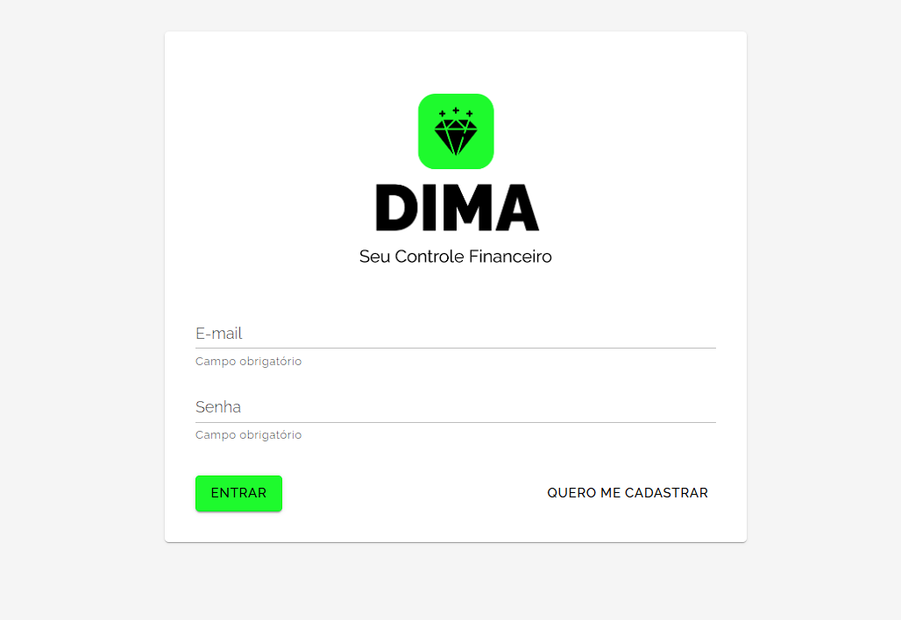
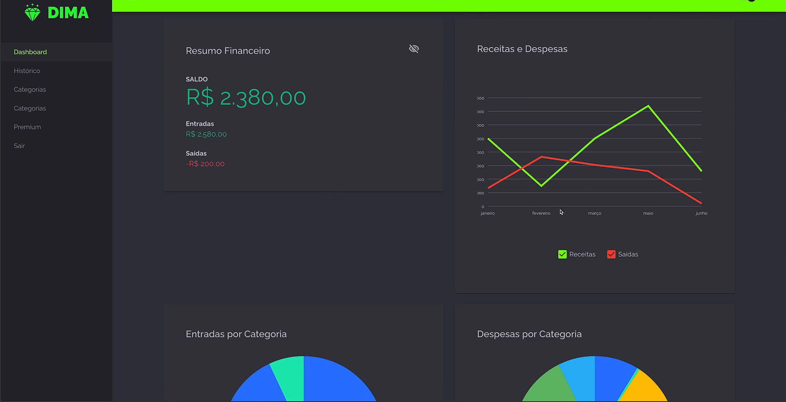
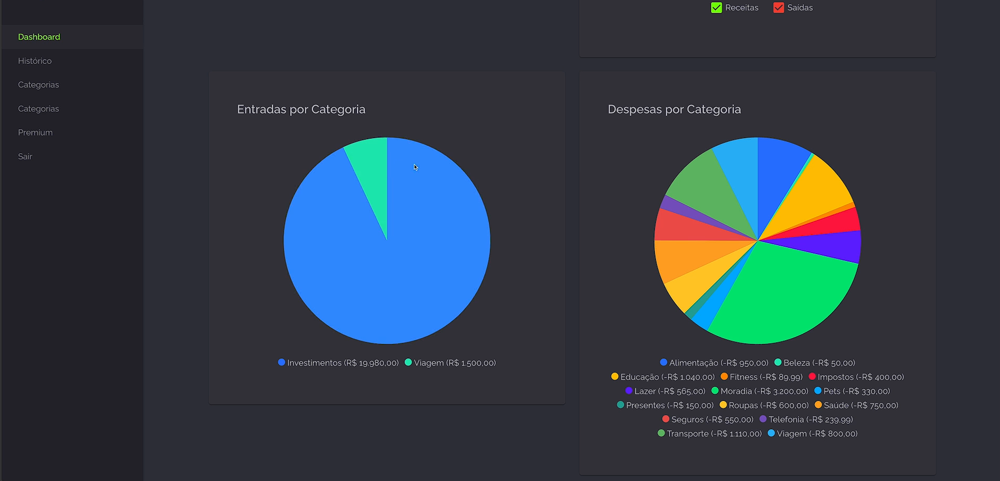
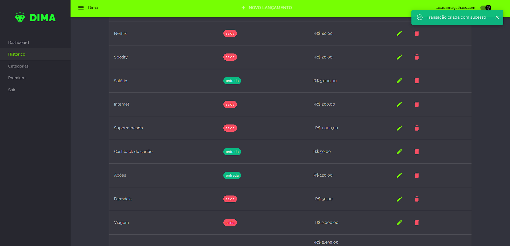
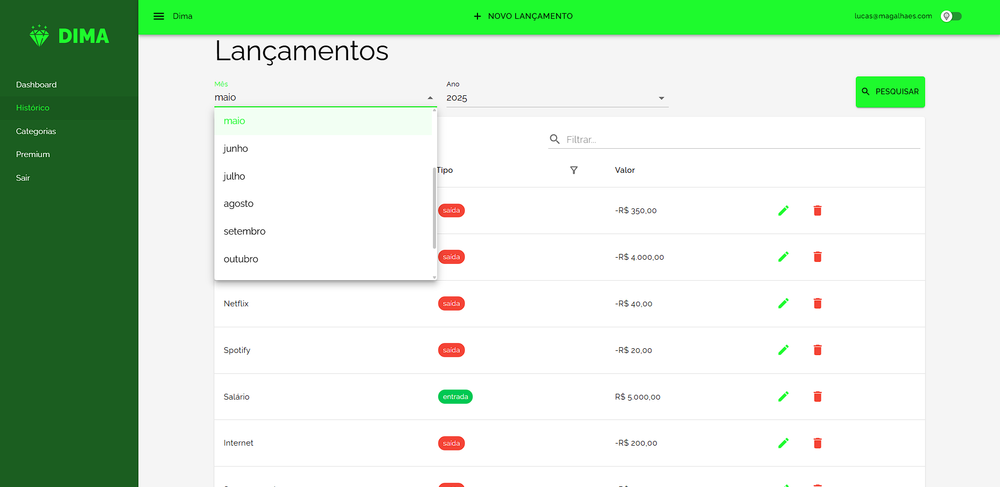
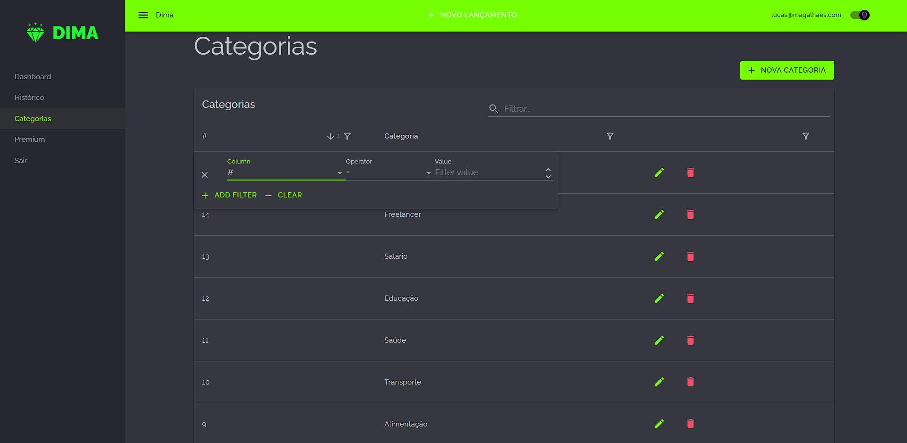
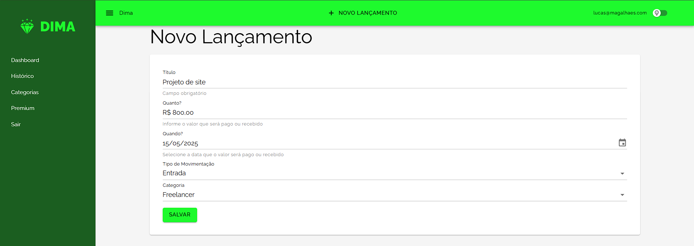
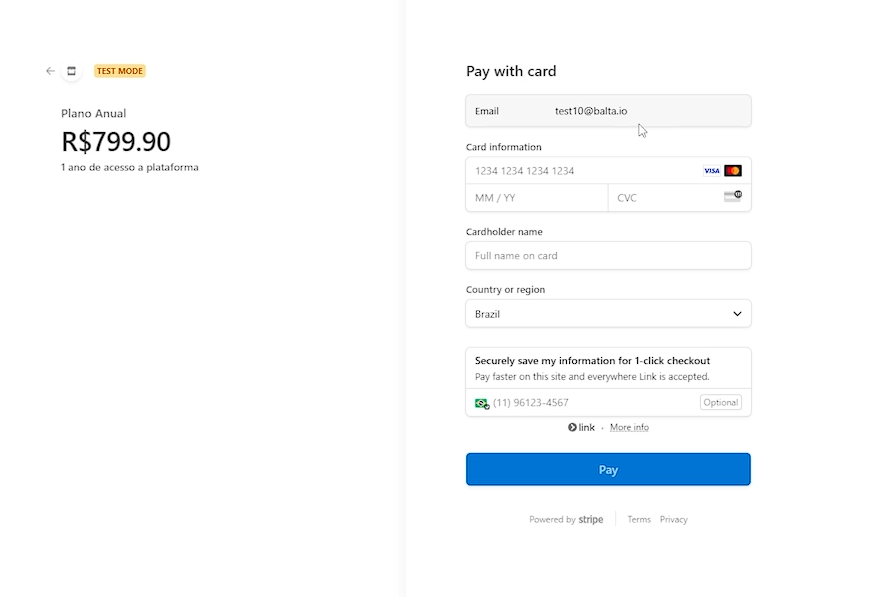
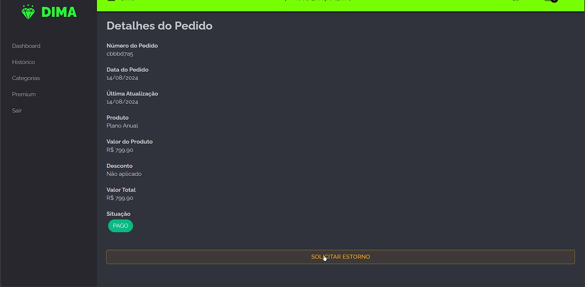

<p align="center">
  
</p>
</br>

**Dima** é um sistema moderno para controle financeiro pessoal. Permite ao usuário gerenciar entradas e saídas de capital, visualizar relatórios por mês e ano, analisar gráficos por categoria e realizar pagamentos através do Stripe. Construído com .NET Blazor, SQL Server e APIs minimalistas, o sistema tem foco em usabilidade, performance e boas práticas de código.

---

## 📷 Visão Geral do Sistema

### 🔐 Login Seguro

Tela de autenticação com ASP.NET Identity. Permite login e cadastro de usuários.

<p align="center">
  
</p>


### 📊 Dashboard Financeiro

Resumo com saldo, entradas, saídas e gráfico comparativo mensal.

<p align="center">
  
</p>

### 🧁 Análises por Categoria

Gráficos de pizza interativos para entradas e saídas por categoria.

<p align="center">
  
</p>

### 📜 Histórico de Transações

Lista de lançamentos com edição, exclusão e classificação.

<p align="center">
  
</p>

### 📆 Filtros por Período

Busca avançada por mês, ano e texto.

<p align="center">
  
</p>

### 🗂️ Gestão de Categorias

CRUD com filtros e busca para organização de lançamentos.

<p align="center">
  
</p>

### 📝 Novo Lançamento

Formulário para cadastrar receitas e despesas.

<p align="center">
  
</p>

### 💳 Pagamento Stripe

Checkout funcional com plano premium e ambiente de testes.

<p align="center">
  
</p>

### 📦 Detalhes do Pedido e Estorno

Visualização completa do pedido, incluindo data, produto, valor e status, com opção de solicitar estorno diretamente pela interface.

<p align="center">
  
</p>

---

## 🚀 Funcionalidades

* Autenticação com ASP.NET Identity
* Dashboard com gráficos mensais
* CRUD de lançamentos e categorias
* Filtro por mês, ano e busca textual
* Integração com Stripe para planos pagos
* Documentação Swagger

---

## 📐 Boas Práticas e Padrões

* **Handlers**: responsabilidades isoladas para cada operação
* **Separação de Responsabilidades (SoC)**: lógica distribuída entre camadas
* **Clean Code**: código limpo, legível e reutilizável
* **Princípios SOLID**: base para manutenção e escalabilidade
* **Branches de Trabalho:**: o projeto conta com 3 branches distintas, organizadas por escopo (Web, Core, API), incluindo uma branch exclusiva para a migração do .NET 8 para o .NET 9, demonstrando controle de versão e separação de contexto ao longo do desenvolvimento

---

## 🎨 Experiência de Usuário (UI/UX)

O Dima oferece uma experiência refinada e automatizada para o usuário final:

- 🎨 Tema escuro ou claro ajustado automaticamente conforme o sistema operacional
- 📆 Campos pré-preenchidos com dados inteligentes (ex: data atual selecionada automaticamente)
- 🧠 Seleção de categorias com preenchimento dinâmico com base nas já cadastradas
- 💲 Formatação monetária automática em todos os valores
- ✅ Feedbacks visuais em todas as ações realizadas com sucesso ou erro

Esses recursos otimizam a jornada do usuário e reduzem fricções na utilização da plataforma.

---


## 🧠 Arquitetura

```
Dima
├── Dima.Api     → Minimal APIs, Endpoints e Swagger
├── Dima.Core    → Models, DTOs, Requests, Responses
├── Dima.Web     → Interface em Blazor Server
```

---

## 🛠️ Tecnologias

* .NET 9 com C#
* Blazor Server + MudBlazor
* SQL Server + EF Core
* Swagger
* Stripe API

---

## 🧪 Executando o Projeto

```bash
# Clonar o projeto
git clone https://github.com/seu-usuario/dima.git
cd dima

# Restaurar pacotes e rodar a API
dotnet restore
dotnet run --project Dima.Api

# Executar frontend
cd Dima.Web
dotnet run
```

---

## 👨‍💻 Autor

Desenvolvido por **Lucas Magalhães**
🔗 [LinkedIn](www.linkedin.com/in/lucas-magalhães-702684291) | [GitHub](https://github.com/Lucas-magalhaes1)


